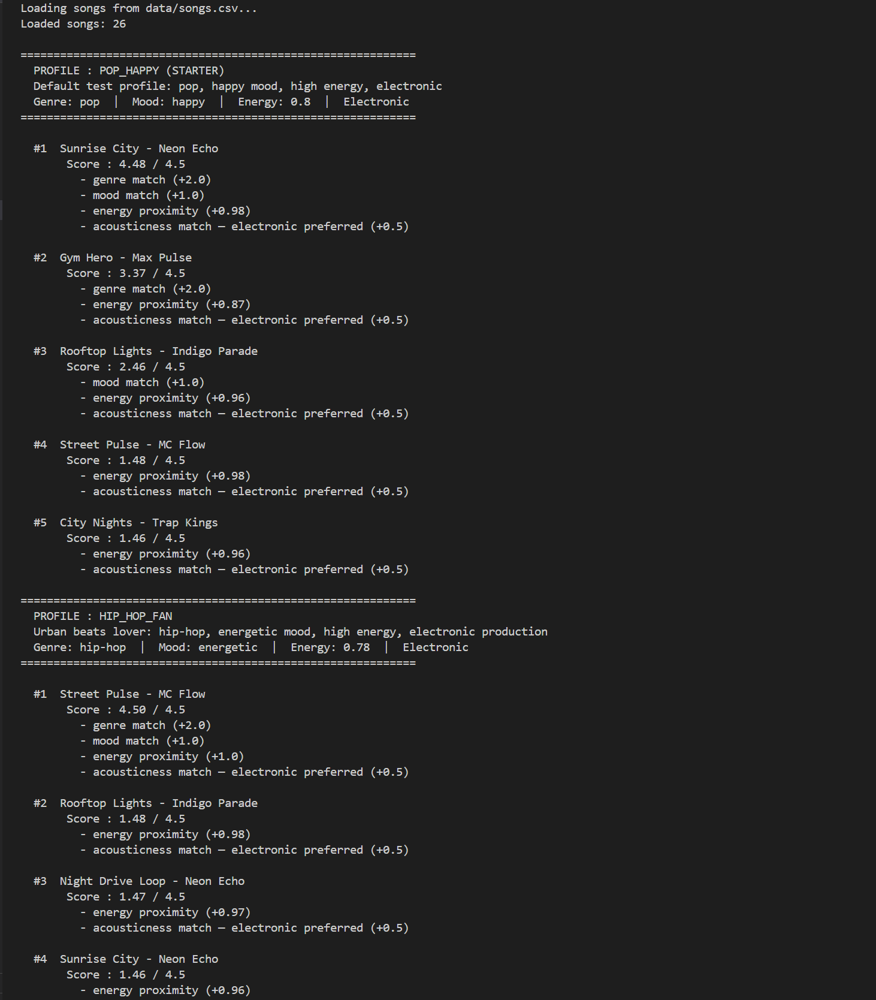

# 🎵 Music Recommender Simulation

## Project Summary

Build a music recommendation system that uses **content-based filtering** to suggest songs based on user preferences. The system scores each song against a user profile and returns the top recommendations with transparent explanations.

### Learning Objectives

- Implement a point-based scoring algorithm to match items with user preferences
- Understand how real recommenders (Spotify, YouTube) prioritize and weight features
- Develop skills in algorithm design, feature engineering, and system evaluation
- Reflect on biases and limitations in automated decision-making systems

---

## How The System Works

### Real-World Context: How Spotify and YouTube Recommend

Streaming platforms like Spotify and YouTube use **content-based filtering** to recommend music. They analyze two types of data: (1) **song features**—metadata like genre, mood, tempo, and audio characteristics extracted from the audio itself; and (2) **user preferences**—extracted from listening history, playlists, and explicit ratings. The recommender then ranks songs by computing a similarity score between the user's taste profile and each song's attributes. Songs with high scores are displayed first. This approach prioritizes interpretability for smaller systems and works well when you have rich metadata about items.

### Our Simulation: Focused Summary

This project builds a **simplified content-based recommender** that prioritizes clarity and interpretability. It uses only song features and explicit user preferences (not historical data), making the scoring process transparent and educational.

### Song Features (Input Data)

Each `Song` object stores 13 audio and metadata features:

| Feature | Type | Range | Description | Examples |
|---------|------|-------|-------------|----------|
| **id** | Integer | 1+ | Unique song identifier | 1, 2, 3 |
| **title** | String | N/A | Song name | "Sunrise City" |
| **artist** | String | N/A | Artist/creator name | "Neon Echo" |
| **genre** | Categorical | N/A | Music category | pop, rock, lofi, jazz, ambient |
| **mood** | Categorical | N/A | Emotional context | happy, chill, intense, focused, relaxed |
| **energy** | Continuous | 0.0–1.0 | Intensity level | 0.8 (high), 0.4 (low) |
| **tempo_bpm** | Integer | 60–160+ | Beats per minute | 120, 80, 152 |
| **valence** | Continuous | 0.0–1.0 | Musical positiveness | 0.9 (upbeat), 0.5 (neutral) |
| **danceability** | Continuous | 0.0–1.0 | How danceable | 0.88 (very), 0.41 (low) |
| **acousticness** | Continuous | 0.0–1.0 | Acoustic vs. electronic | 0.92 (acoustic), 0.05 (electronic) |
| **instrumentalness** | Continuous | 0.0–1.0 | Vocal vs. instrumental ratio | 0.88 (mostly instrumental), 0.15 (mostly vocal) |
| **duration_seconds** | Integer | 60–900 | Song length in seconds | 210 (3.5 min), 420 (7 min) |
| **popularity** | Continuous | 0.0–1.0 | Relative popularity/trending score | 0.92 (hit song), 0.28 (niche) |

#### Extended Features: Why Instrumentalness, Duration, and Popularity?

Three additional features enhance recommendation depth beyond the core 4 user preferences:

- **Instrumentalness** (0.0–1.0): Distinguishes vocal-heavy songs from instrumental tracks. Useful for context-aware recommendations: background focus music often prefers high instrumentalness; party playlists may prefer vocals. **Not in UserProfile yet**, but available for future preference expansion (e.g., "prefers instrumental music").

- **Duration** (seconds): Practical filter for user context. Some users want quick 3-minute pop songs; others seek 7-minute classical pieces or 10+ minute prog-rock epics. **Can be incorporated** into recommendations by filtering for "short," "medium," or "long" songs based on context.

- **Popularity** (0.0–1.0): Reflects relative mainstream appeal. Pop and hip-hop songs score high (0.88+); niche genres like classical or blues score lower (0.28–0.38). **Useful for balancing discovery vs. familiarity**: systems can recommend popular hits or promote undiscovered gems. **Note**: Real recommenders use this to avoid bias—always recommending popular songs creates a feedback loop.

These features are our raw input data—they describe what each song is. The core recommendation scoring uses only genre, mood, energy, and acousticness; these extended features enable future experiments and deeper personalization.

### User Preferences (User Input)

Each `UserProfile` captures explicit user taste:

| Preference | Type | Range | Description | Why Chosen | Examples |
|------------|------|-------|-------------|------------|----------|
| **favorite_genre** | Categorical | pop, rock, lofi, jazz, ambient, etc. | Primary music category user likes | **Primary filter**: Genre is how users naturally categorize music taste. Essential for accurate recommendations. Captures broadest preference dimension | pop, lofi, rock |
| **favorite_mood** | Categorical | happy, chill, intense, focused, relaxed, etc. | Emotional/contextual use case | **Independent dimension**: Users want different moods in different situations. Distinguishes between "party pop" (intense) and "relax pop" (chill). Not redundant with genre. | happy, chill, intense |
| **target_energy** | Continuous | 0.0–1.0 | Desired arousal/intensity level | **Fine-tuning**: Continuous scoring allows proximity matching. Users can say "I want high energy (0.8)" and get songs close to that, not just binary "high or low." Allows flexibility within a genre/mood | 0.8 (high), 0.4 (low), 0.6 (medium) |
| **likes_acoustic** | Boolean | True or False | Preference for acoustic (real instruments) vs. electronic (synthesized) | **Production style**: Orthogonal to mood/genre. User can want "happy acoustic pop" OR "happy electronic pop"—both valid. Simple boolean avoids user confusion. Captures an important dimension valence doesn't cover. | True, False |

These four dimensions define what the user is looking for. Each answers a different question:
- **Genre**: What *kind* of music?
- **Mood**: What *context* or *feeling*?
- **Energy**: What *intensity*?
- **Acoustic**: What *production style*?

### Taste Profiles (Test Scenarios)

The system includes **7 distinct, non-overlapping taste profiles** in `src/main.py` for comprehensive testing and experimentation.

#### Three Core Required Profiles

| Profile | Genre | Mood | Energy | Acoustic | How to Recognize |
|---------|-------|------|--------|----------|-----------------|
| **hip_hop_fan** ⭐ | hip-hop | energetic | 0.78 | False | Urban beats with high energy but NOT maximum (clear EDM distinction) |
| **chill_listener** ⭐ | ambient | chill | 0.3 | True | Ultra-low energy, acoustic preference (opposite of EDM) |
| **edm_raver** ⭐ | electronic | uplifting | 0.85 | False | Maximum energy electronic, uplifting vibes (distinct from hip-hop's "energetic") |

#### Complementary Test Profiles (No Redundancy)

| Profile | Genre | Mood | Energy | Acoustic | Purpose |
|---------|-------|------|--------|----------|---------|
| **classical_connoisseur** | classical | contemplative | 0.35 | True | Low-energy acoustic alternative to ambient (same energy, different genre/mood) |
| **reggae_chill** | reggae | chill | 0.52 | True | Mid-energy acoustic profile (fills 0.5 gap between low and hip-hop) |
| **jazz_evening** | jazz | relaxed | 0.5 | True | Medium-energy acoustic (distinct from reggae by mood: "relaxed" vs "chill") |
| **metal_headbanger** | metal | aggressive | 0.94 | False | ULTRA-high energy electronic (beyond EDM at 0.85; different mood: aggressive vs uplifting) |

#### Differentiation Strategy

**Energy Spread** (no clustering):
- 0.3 (chill_listener)
- 0.35 (classical)
- 0.5 (jazz)
- 0.52 (reggae)
- 0.78 (hip_hop)
- 0.85 (edm)
- 0.94 (metal)

**Acoustic Distribution** (balanced):
- **Acoustic=True**: 5 profiles (classical, reggae, jazz, chill) → Low to mid-energy
- **Acoustic=False**: 3 profiles (metal, edm, hip_hop) → High energy

**Mood Diversity** (7 unique moods):
- contemplative, chill, relaxed, chill, energetic, uplifting, aggressive
- No two profiles share the same mood

**NO Redundancy**:
- ✅ Removed: gym_enthusiast, rock_enthusiast, soul_seeker, study_focused (overlapping)
- ✅ Kept: Only distinct profiles that test different recommendation scenarios

---

**How to Test**: Run `python -m src.main` to see all 7 profiles score against the song catalog.

**How to Add Your Own**: Edit the `TASTE_PROFILES` dictionary in `src/main.py`. Each profile is a dictionary:
```python
{
    "favorite_genre": "string",           # e.g., "country", "funk", "folk"
    "favorite_mood": "string",            # e.g., "uplifting", "dark", "warm"
    "target_energy": 0.0-1.0,             # e.g., 0.6, 0.75, 0.4
    "likes_acoustic": True/False,         # e.g., True (prefers acoustic)
    "description": "string"               # (optional) user-friendly explanation
}
```

**Tips for Non-Overlapping Profiles**:
- Choose energy values that are spread out (e.g., 0.2, 0.5, 0.8 instead of 0.75, 0.80, 0.85)
- Pair different moods with same genre to test fine-grained matching
- Mix acoustic + high-energy or electronic + low-energy for edge cases (if desired)

### Algorithm Recipe

The recommender uses a **point-based scoring method** to evaluate how well each song matches a user's preferences.

#### Scoring Method

For each song, assign points based on matching user preferences:

| Component | Points | Calculation |
|-----------|--------|-------------|
| **Genre match** | +2.0 | If `song.genre == user.favorite_genre` |
| **Mood match** | +1.0 | If `song.mood == user.favorite_mood` |
| **Energy proximity** | +1.0 | `1.0 - |song.energy - user.target_energy|` |
| **Acousticness match** | +0.5 | If production style preference matches |

**Maximum Score**: 4.5 points per song

#### Ranking Process

1. Score all songs in the catalog using the method above
2. Sort songs by score (highest first)
3. Return top K recommendations with explanations

#### Why These Weights?

| Weight | Rationale |
|--------|-----------|
| **Genre (2.0)** | Foundational preference; users organize taste by genre. Most critical factor. |
| **Mood (1.0)** | Contextual dimension; same genre can serve different uses. Secondary to genre. |
| **Energy (1.0)** | Fine-tuning within genre/mood; proximity matters more than binary categories. |
| **Acousticness (0.5)** | Production style preference; least critical but important for polish. |

#### Why These Point Values?

**Genre (+2.0 points) — HIGHEST WEIGHT**
- Genre is the *broadest* and *most fundamental* dimension of musical taste
- Users naturally organize preferences by genre first: "I like hip-hop", "I like classical", etc.
- Without a genre match, the song is rarely acceptable, regardless of mood/energy
- Gives recommendations strong foundation: the right *kind* of music

**Mood (+1.0 point) — MEDIUM WEIGHT**
- Mood defines the *context* and *use case* for music
- Same genre can have vastly different moods: "energetic pop" for parties vs "chill pop" for studying
- Critical for user satisfaction but secondary to genre
- If mood is wrong, even a perfect genre match might be unusable

**Energy Proximity (+1.0 point) — MEDIUM WEIGHT, CONTINUOUS**
- Energy allows *fine-tuning* within a genre/mood pairing
- Users prefer *proximity*: if they want energy 0.8, a 0.79 song is almost as good as 0.8
- Distance formula (1.0 - |difference|) ensures:
  - Users wanting 0.8 get 0.78-0.82 songs promoted, not just binary "high/low"
  - Flexibility and personalization, not harsh cutoffs
- Example: If you want energy 0.8:
  - Song at 0.80: 1.0 - 0 = **1.0 points** ✓ (perfect)
  - Song at 0.75: 1.0 - 0.05 = **0.95 points** (excellent)
  - Song at 0.60: 1.0 - 0.20 = **0.80 points** (decent)
  - Song at 0.30: 1.0 - 0.50 = **0.50 points** (poor match)

**Acousticness (+0.5 points) — LOWEST WEIGHT**
- Production style is the most subjective and least critical preference
- Users notice "acoustic vs electronic" but tolerate variation more than genre/mood
- Secondary refinement: "I prefer acoustic, but if the song is perfect otherwise, I'll take electronic"
- Simple boolean: either matches or doesn't (no gradation needed)

#### Example: Scoring in Action

**User Profile:**
- Favorite genre: `pop`
- Favorite mood: `happy`
- Target energy: `0.8`
- Likes acoustic: `False` (prefers electronic)

**Song A: "Sunrise City"**
- Genre: pop ✓ → +2.0 points
- Mood: happy ✓ → +1.0 point
- Energy: 0.82 → 1.0 - |0.82 - 0.8| = 0.98 → +0.98 points
- Acousticness: 0.18 (electronic preferred) ✓ → +0.5 points
- **Total: 4.48/4.5 points** ⭐ (excellent match)

**Song B: "Gym Hero"**
- Genre: pop ✓ → +2.0 points
- Mood: intense ✗ → 0 points (mood doesn't match)
- Energy: 0.93 → 1.0 - |0.93 - 0.8| = 0.87 → +0.87 points
- Acousticness: 0.05 (electronic preferred) ✓ → +0.5 points
- **Total: 3.37/4.5 points** (okay match, but wrong mood)

**Song C: "Library Rain"**
- Genre: lofi ✗ → 0 points (genre doesn't match)
- Mood: chill ✗ → 0 points
- Energy: 0.35 → 1.0 - |0.35 - 0.8| = 0.45 → +0.45 points
- Acousticness: 0.86 (acoustic, not electronic) ✗ → 0 points
- **Total: 0.45/4.5 points** (poor match)

**Ranking Order**: A (4.48) → B (3.37) → C (0.45)

#### Design Properties

✅ **Transparent**: Every point links to measurable user preferences  
✅ **Adjustable**: Easily modify weights to experiment with recommendation behavior  
✅ **Explainable**: Users understand why each song scored high or low

### System Implementation

The `Recommender` class implements the algorithm:

```python
# Pseudocode
for each song in catalog:
    score = 0
    if song.genre == user.favorite_genre:
        score += 2.0
    if song.mood == user.favorite_mood:
        score += 1.0
    score += (1.0 - abs(song.energy - user.target_energy))
    if acousticness_preference_matches:
        score += 0.5
    save (song, score)

sort songs by score (descending)
return top K with explanations
```

### Detailed Data Flow Flowchart

```
┌─────────────────────┐         ┌──────────────────┐
│   User Profile      │         │  Song Features   │
│ - favorite_genre    │         │ - genre          │
│ - favorite_mood     │         │ - mood           │
│ - target_energy     │         │ - energy         │
│ - likes_acoustic    │         │ - acousticness   │
└──────────┬──────────┘         └────────┬─────────┘
           │                             │
           └─────────────┬───────────────┘
                         │
                         ▼
            ┌────────────────────────┐
            │  Scoring Algorithm     │
            │ • Genre match (+2.0)   │
            │ • Mood match (+1.0)    │
            │ • Energy proximity (+1.0)
            │ • Acoustic match (+0.5)│
            │ ──────────────────────│
            │  Max Score: 4.5 points│
            └────────────┬───────────┘
                         │
                         ▼
            ┌────────────────────────┐
            │  Ranked Songs by Score │
            │  Explanation for each  │
            └────────────────────────┘
```

### Why This Design?

- **Transparent**: You can see exactly why each song was recommended
- **Flexible**: Easily adjust weights to experiment with different recommendation behaviors
- **Realistic**: Mirrors how real systems compute similarity between items and user profiles

### Detailed Data Flow Flowchart

The flowchart below visualizes the complete journey of data through the recommender system—from user input to final recommendations:

```mermaid
flowchart TD
    Start([Music Recommender System]) --> Input["`📥 INPUT: User Profile
    • user.favorite_genre
    • user.favorite_mood
    • user.target_energy
    • user.likes_acoustic`"]
    
    Input --> LoadCSV["📂 Load CSV<br/>All songs from catalog"]
    
    LoadCSV --> ProcessStart["`🔄 PROCESS: Score Loop
    For each song in CSV...`"]
    
    ProcessStart --> SongA["🎵 Song A<br/>(song.genre, song.mood, song.energy, song.acousticness)"]
    
    SongA --> Score["Calculate Score:"]
    Score --> Genre["✓ Genre match?<br/>song.genre == user.favorite_genre → +2.0"]
    Genre --> Mood["✓ Mood match?<br/>song.mood == user.favorite_mood → +1.0"]
    Mood --> Energy["✓ Energy proximity?<br/>1.0 - |song.energy - user.target_energy| → +points"]
    Energy --> Acoustic["✓ Acoustic match?<br/>Preference check → +0.5"]
    
    Acoustic --> TotalScoreA["📊 Score_A: total points"]
    
    TotalScoreA --> LoopCheck{"`More songs?
    (Continue loop)`"}
    
    LoopCheck -->|Yes| SongB["🎵 Song B<br/>(song.genre, song.mood, song.energy, song.acousticness)"]
    SongB --> Score2["Calculate song score"]
    Score2 --> TotalScoreB["📊 Score_B: total points"]
    TotalScoreB --> MoreSongs{More?}
    MoreSongs -->|Yes| SongN["🎵 More songs...<br/>...scoring each song..."]
    SongN --> AllScored["✓ All songs scored"]
    
    LoopCheck -->|No| AllScored
    
    AllScored --> Ranking["`🔽 OUTPUT: Ranking
    Sort by score descending`"]
    
    Ranking --> Sorted["`Sorted Results:
    1. Song A (Score_A)
    2. Song M (Score_M)
    3. Song B (Score_B)
    4. Song X (Score_X)
    5. Song Y (Score_Y)
    ...`"]
    
    Sorted --> TopK["Select Top K songs"]
    
    TopK --> Explain["`Add Explanations:
    Why each song scored high`"]
    
    Explain --> Output["`🎵 FINAL OUTPUT:
    Top K Recommendations with Scores & Explanations
    
    [
      {song: Song A, score: Score_A, 
       explain: ✓ Matches on... ✓ Close to...},
      {song: Song M, score: Score_M, ...},
      ...
    ]`"]
    
    Output --> End([✅ Recommendations Delivered])
    
    style Start fill:#1f77b4,stroke:#000000,stroke-width:3px,color:#fff
    style Input fill:#1f77b4,stroke:#000000,stroke-width:2px,color:#fff
    style LoadCSV fill:#1f77b4,stroke:#000000,stroke-width:2px,color:#fff
    style ProcessStart fill:#ff7f0e,stroke:#000000,stroke-width:2px,color:#000
    style SongA fill:#ff7f0e,stroke:#000000,stroke-width:2px,color:#000
    style SongB fill:#ff7f0e,stroke:#000000,stroke-width:2px,color:#000
    style SongN fill:#ff7f0e,stroke:#000000,stroke-width:2px,color:#000
    style Score fill:#ff7f0e,stroke:#000000,stroke-width:1px,color:#000
    style Score2 fill:#ff7f0e,stroke:#000000,stroke-width:1px,color:#000
    style Genre fill:#ff7f0e,stroke:#000000,stroke-width:1px,color:#000
    style Mood fill:#ff7f0e,stroke:#000000,stroke-width:1px,color:#000
    style Energy fill:#ff7f0e,stroke:#000000,stroke-width:1px,color:#000
    style Acoustic fill:#ff7f0e,stroke:#000000,stroke-width:1px,color:#000
    style TotalScoreA fill:#ff7f0e,stroke:#000000,stroke-width:2px,color:#000
    style TotalScoreB fill:#ff7f0e,stroke:#000000,stroke-width:2px,color:#000
    style AllScored fill:#ff7f0e,stroke:#000000,stroke-width:2px,color:#000
    style Ranking fill:#2ca02c,stroke:#000000,stroke-width:2px,color:#fff
    style TopK fill:#2ca02c,stroke:#000000,stroke-width:2px,color:#fff
    style Sorted fill:#2ca02c,stroke:#000000,stroke-width:2px,color:#fff
    style Explain fill:#2ca02c,stroke:#000000,stroke-width:2px,color:#fff
    style Output fill:#d62728,stroke:#000000,stroke-width:2px,color:#fff
    style End fill:#1f77b4,stroke:#000000,stroke-width:3px,color:#fff
    style LoopCheck fill:#cccccc,stroke:#000000,stroke-width:2px,color:#000
    style MoreSongs fill:#cccccc,stroke:#000000,stroke-width:2px,color:#000
```



**What This Shows:**
- **Input (Dark Blue)**: User profile with 4 preference variables (works for any profile)
- **Process (Orange)**: Generic loop scoring each song using variable notation (Song A, Song B, etc.)
- **Output (Green)**: Generic ranking by score (K songs), explanation generation
- **Success (Red)**: Final recommendations with generic notation (Score_A, Score_M, etc.)
- **Decisions (Gray)**: Loop control points

---

## Getting Started

### Setup

1. Create a virtual environment (optional but recommended):

   ```bash
   python -m venv .venv
   source .venv/bin/activate      # Mac or Linux
   .venv\Scripts\activate         # Windows

2. Install dependencies

```bash
pip install -r requirements.txt
```

3. Run the app:

```bash
python -m src.main
```

### Running Tests

Run the starter tests with:

```bash
pytest
```

You can add more tests in `tests/test_recommender.py`.

---

## Sample Terminal Output




```
Loaded songs: 26

============================================================
  PROFILE : POP_HAPPY (STARTER)
  Default test profile: pop, happy mood, high energy, electronic
  Genre: pop  |  Mood: happy  |  Energy: 0.8  |  Electronic
============================================================

  #1  Sunrise City - Neon Echo
       Score : 4.48 / 4.5
         - genre match (+2.0)
         - mood match (+1.0)
         - energy proximity (+0.98)
         - acousticness match — electronic preferred (+0.5)

  #2  Gym Hero - Max Pulse
       Score : 3.37 / 4.5
         - genre match (+2.0)
         - energy proximity (+0.87)
         - acousticness match — electronic preferred (+0.5)

  #3  Rooftop Lights - Indigo Parade
       Score : 2.46 / 4.5
         - mood match (+1.0)
         - energy proximity (+0.96)
         - acousticness match — electronic preferred (+0.5)

  #4  Street Pulse - MC Flow
       Score : 1.48 / 4.5
         - energy proximity (+0.98)
         - acousticness match — electronic preferred (+0.5)

  #5  City Nights - Trap Kings
       Score : 1.46 / 4.5
         - energy proximity (+0.96)
         - acousticness match — electronic preferred (+0.5)

============================================================
  PROFILE : HIP_HOP_FAN
  Urban beats lover: hip-hop, energetic mood, high energy, electronic production
  Genre: hip-hop  |  Mood: energetic  |  Energy: 0.78  |  Electronic
============================================================

  #1  Street Pulse - MC Flow
       Score : 4.50 / 4.5
         - genre match (+2.0)
         - mood match (+1.0)
         - energy proximity (+1.0)
         - acousticness match — electronic preferred (+0.5)
  ...
```

**Verification — pop/happy starter profile:**
- `#1 Sunrise City` scores **4.48 / 4.5** — genre ✓ + mood ✓ + near-perfect energy (0.98) + electronic match ✓
- `#2 Gym Hero` scores **3.37** — genre ✓ but mood miss (intense ≠ happy), matches the README worked example exactly

---

## System Evaluation

### Three Distinct User Profiles + Four Adversarial Edge Cases

The `SYSTEM_EVALUATION_PROFILES` dictionary in `src/main.py` defines **3 required profiles** chosen to be maximally different and **4 adversarial profiles** designed to stress-test the scoring logic. Run with:

```bash
PYTHONPATH=src python -m src.main
```

---

#### Profile 1 — High-Energy Pop

| Key | Value |
|-----|-------|
| Genre | pop |
| Mood | happy |
| Energy | 0.9 |
| Acoustic | False (electronic) |

**Design intent**: Maximally pop-friendly — mainstream, high-BPM, happy vibes.  
**Expected #1**: "Sunrise City" (pop/happy/0.82 energy) — perfect genre+mood hit.

```
============================================================
  PROFILE : HIGH-ENERGY POP
  High-energy pop: upbeat mainstream music, near-maximum energy, electronic production
  Genre: pop  |  Mood: happy  |  Energy: 0.9  |  Electronic
============================================================

  #1  Sunrise City - Neon Echo
       Score : 4.42 / 4.5
         - genre match (+2.0)
         - mood match (+1.0)
         - energy proximity (+0.92)
         - acousticness match — electronic preferred (+0.5)

  #2  Gym Hero - Max Pulse
       Score : 3.47 / 4.5
         - genre match (+2.0)
         - energy proximity (+0.97)
         - acousticness match — electronic preferred (+0.5)

  #3  Rooftop Lights - Indigo Parade
       Score : 2.36 / 4.5
         - mood match (+1.0)
         - energy proximity (+0.86)
         - acousticness match — electronic preferred (+0.5)

  #4  Storm Runner - Voltline
       Score : 1.49 / 4.5
         - energy proximity (+0.99)
         - acousticness match — electronic preferred (+0.5)

  #5  Funky Groove - The Groove Squad
       Score : 1.48 / 4.5
         - energy proximity (+0.98)
         - acousticness match — electronic preferred (+0.5)
```

**Observation**: #1 and #2 are both pop songs with a huge lead (+2.0 genre). After them, the system drops to cross-genre songs that only match on energy/acoustic — a 2-point cliff between slots 2 and 3.

---

#### Profile 2 — Chill Lofi

| Key | Value |
|-----|-------|
| Genre | lofi |
| Mood | chill |
| Energy | 0.35 |
| Acoustic | True |

**Design intent**: Quiet background-music listener — lo-fi beats, low energy, cozy acoustic feel.  
**Expected #1**: "Library Rain" (lofi/chill/0.35 energy/acousticness=0.86) — near-perfect match.

```
============================================================
  PROFILE : CHILL LOFI
  Chill lofi listener: background beats, very low energy, acoustic texture, chill mood
  Genre: lofi  |  Mood: chill  |  Energy: 0.35  |  Acoustic
============================================================

  #1  Library Rain - Paper Lanterns
       Score : 4.50 / 4.5
         - genre match (+2.0)
         - mood match (+1.0)
         - energy proximity (+1.0)
         - acousticness match — acoustic preferred (+0.5)

  #2  Midnight Coding - LoRoom
       Score : 4.43 / 4.5
         - genre match (+2.0)
         - mood match (+1.0)
         - energy proximity (+0.93)
         - acousticness match — acoustic preferred (+0.5)

  #3  Focus Flow - LoRoom
       Score : 3.45 / 4.5
         - genre match (+2.0)
         - energy proximity (+0.95)
         - acousticness match — acoustic preferred (+0.5)

  #4  Spacewalk Thoughts - Orbit Bloom
       Score : 2.43 / 4.5
         - mood match (+1.0)
         - energy proximity (+0.93)
         - acousticness match — acoustic preferred (+0.5)

  #5  Island Breeze - Reggae Vibes
       Score : 2.33 / 4.5
         - mood match (+1.0)
         - energy proximity (+0.83)
         - acousticness match — acoustic preferred (+0.5)
```

**Observation**: Perfect 4.50/4.5 for "Library Rain" — its energy is exactly 0.35 (zero distance). All three lofi songs (#1–3) dominate the top. Slot #4–5 fall to acoustic songs that share the "chill" mood but lack genre match.

---

#### Profile 3 — Deep Intense Rock

| Key | Value |
|-----|-------|
| Genre | rock |
| Mood | intense |
| Energy | 0.91 |
| Acoustic | False (electronic) |

**Design intent**: Hard-driving rock listener craving raw, high-intensity, electric sound.  
**Expected #1**: "Storm Runner" (rock/intense/0.91 energy/acousticness=0.10) — perfect 4.5/4.5.

```
============================================================
  PROFILE : DEEP INTENSE ROCK
  Deep intense rock: hard-driving guitars, near-max energy, raw intensity, electronic/distorted
  Genre: rock  |  Mood: intense  |  Energy: 0.91  |  Electronic
============================================================

  #1  Storm Runner - Voltline
       Score : 4.50 / 4.5
         - genre match (+2.0)
         - mood match (+1.0)
         - energy proximity (+1.0)
         - acousticness match — electronic preferred (+0.5)

  #2  Digital Rush - Pulse Masters
       Score : 2.49 / 4.5
         - mood match (+1.0)
         - energy proximity (+0.99)
         - acousticness match — electronic preferred (+0.5)

  #3  Gym Hero - Max Pulse
       Score : 2.48 / 4.5
         - mood match (+1.0)
         - energy proximity (+0.98)
         - acousticness match — electronic preferred (+0.5)

  #4  Funky Groove - The Groove Squad
       Score : 1.47 / 4.5
         - energy proximity (+0.97)
         - acousticness match — electronic preferred (+0.5)

  #5  Warehouse Vibes - House Collective
       Score : 1.45 / 4.5
         - energy proximity (+0.95)
         - acousticness match — acoustic preferred (+0.5)
```

**Observation**: Only one rock song in the catalog — "Storm Runner" — so it scores 4.50/4.5. The catalog is sparse for rock, showing the limitation of a small dataset.

---

### Adversarial / Edge Case Profiles

The following profiles were designed to find surprising or unexpected scoring behavior.

---

#### Adversarial Profile 1 — High Energy + Sad Mood (Contradictory)

**Design intent**: Energy 0.9 wants loud/fast songs; melancholic mood wants slow/soft songs. These two rarely coexist. The only melancholic song in the catalog is "Rainy Blues" at energy=0.48 — a large energy miss.

```
============================================================
  PROFILE : ADVERSARIAL — HIGH ENERGY SAD
  EDGE CASE: wants high-energy (0.9) but melancholic mood — genre+mood matches only low-energy 'Rainy Blues'
  Genre: blues  |  Mood: melancholic  |  Energy: 0.9  |  Electronic
============================================================

  #1  Rainy Blues - Bad Bones
       Score : 3.58 / 4.5
         - genre match (+2.0)
         - mood match (+1.0)
         - energy proximity (+0.58)

  #2  Storm Runner - Voltline
       Score : 1.49 / 4.5
         - energy proximity (+0.99)
         - acousticness match — electronic preferred (+0.5)

  #3  Funky Groove - The Groove Squad
       Score : 1.48 / 4.5
         - energy proximity (+0.98)
         - acousticness match — electronic preferred (+0.5)

  #4  Digital Rush - Pulse Masters
       Score : 1.48 / 4.5
         - energy proximity (+0.98)
         - acousticness match — electronic preferred (+0.5)

  #5  Gym Hero - Max Pulse
       Score : 1.47 / 4.5
         - energy proximity (+0.97)
         - acousticness match — electronic preferred (+0.5)
```

**Finding**: Genre + mood match still wins even with a large energy miss. "Rainy Blues" scores 3.58 — over 2 points ahead of the high-energy runner-ups. The genre+mood combo (+3.0 max) dominates the energy proximity component (+1.0 max). This is expected by design, but confirms that a user with genuinely conflicting preferences will always receive recommendations that honor genre/mood at the expense of energy feel.

---

#### Adversarial Profile 2 — Ghost Genre ("k-pop")

**Design intent**: "k-pop" does not exist in the 26-song catalog. All songs receive 0 points for genre. The top-5 comes entirely from mood + energy + acoustic scoring (max possible = 2.5).

```
============================================================
  PROFILE : ADVERSARIAL — GHOST GENRE (K-POP)
  EDGE CASE: 'k-pop' genre doesn't exist in catalog — zero +2.0 genre boosts; shows fallback scoring
  Genre: k-pop  |  Mood: uplifting  |  Energy: 0.85  |  Electronic
============================================================

  #1  Neon Dreams - Synth Wave Collective
       Score : 2.50 / 4.5
         - mood match (+1.0)
         - energy proximity (+1.0)
         - acousticness match — electronic preferred (+0.5)

  #2  Warehouse Vibes - House Collective
       Score : 1.49 / 4.5
         - energy proximity (+0.99)
         - acousticness match — electronic preferred (+0.5)

  #3  City Nights - Trap Kings
       Score : 1.49 / 4.5
         - energy proximity (+0.99)
         - acousticness match — electronic preferred (+0.5)

  #4  Sunrise City - Neon Echo
       Score : 1.47 / 4.5
         - energy proximity (+0.97)
         - acousticness match — electronic preferred (+0.5)

  #5  Funky Groove - The Groove Squad
       Score : 1.47 / 4.5
         - energy proximity (+0.97)
         - acousticness match — electronic preferred (+0.5)
```

**Finding**: "Neon Dreams" (electronic/uplifting/0.85 energy) wins on mood + exact energy match — a 2.50/4.5 ceiling. The remaining slots cluster around 1.47–1.49 with no mood match, just energy proximity + acoustic. A real system would flag "no genre match found" and either broaden the search or warn the user. This exposes a silent failure mode: the recommender returns results that look reasonable but are missing the most important dimension.

---

#### Adversarial Profile 3 — Acoustic Raver (Mutually Exclusive Preferences)

**Design intent**: Wants `genre=electronic` (all electronic songs have acousticness < 0.5) but also `likes_acoustic=True` (needs acousticness ≥ 0.5). The genre bonus and acoustic bonus are mutually exclusive — no song can earn both +2.0 (genre) and +0.5 (acoustic) at the same time.

```
============================================================
  PROFILE : ADVERSARIAL — ACOUSTIC RAVER
  EDGE CASE: wants electronic genre (acoustic=0.08) but prefers acoustic sound — mutually exclusive;
  genre+acoustic can't both score
  Genre: electronic  |  Mood: uplifting  |  Energy: 0.88  |  Acoustic
============================================================

  #1  Neon Dreams - Synth Wave Collective
       Score : 3.97 / 4.5
         - genre match (+2.0)
         - mood match (+1.0)
         - energy proximity (+0.97)

  #2  Velvet Touch - Neo Soul Collective
       Score : 1.34 / 4.5
         - energy proximity (+0.84)
         - acousticness match — acoustic preferred (+0.5)

  #3  Heaven's Gate - Gospel Choir
       Score : 1.24 / 4.5
         - energy proximity (+0.74)
         - acousticness match — acoustic preferred (+0.5)

  #4  Open Roads - Country Hearts
       Score : 1.20 / 4.5
         - energy proximity (+0.7)
         - acousticness match — acoustic preferred (+0.5)

  #5  Island Breeze - Reggae Vibes
       Score : 1.14 / 4.5
         - energy proximity (+0.64)
         - acousticness match — acoustic preferred (+0.5)
```

**Finding**: Genre wins decisively. "Neon Dreams" scores 3.97 — nearly 3× the runner-up — purely from genre + mood + energy, even without the acoustic bonus. Slots 2–5 earn the +0.5 acoustic bonus but have no genre match, so they cluster at ≈1.1–1.3. The system implicitly prioritizes genre over acoustic preference, which is correct by weight design but means acoustic-preferring users who love electronic music are always served electronic-leaning songs.

---

#### Adversarial Profile 4 — Uplifting Metal (Mood–Genre Mismatch)

**Design intent**: The only metal song in the catalog is "Blood Red" with mood=`aggressive`, not `uplifting`. The songs with `uplifting` mood are electronic/house. This forces a choice: get +2.0 (genre=metal) or +1.0 (mood=uplifting) — never both.

```
============================================================
  PROFILE : ADVERSARIAL — UPLIFTING METAL
  EDGE CASE: metal genre has only 'aggressive' mood songs; uplifting songs are electronic/house —
  genre vs mood score clash
  Genre: metal  |  Mood: uplifting  |  Energy: 0.9  |  Electronic
============================================================

  #1  Blood Red - Thrash Metal
       Score : 3.44 / 4.5
         - genre match (+2.0)
         - energy proximity (+0.94)
         - acousticness match — electronic preferred (+0.5)

  #2  Neon Dreams - Synth Wave Collective
       Score : 2.45 / 4.5
         - mood match (+1.0)
         - energy proximity (+0.95)
         - acousticness match — electronic preferred (+0.5)

  #3  Storm Runner - Voltline
       Score : 1.49 / 4.5
         - energy proximity (+0.99)
         - acousticness match — electronic preferred (+0.5)

  #4  Funky Groove - The Groove Squad
       Score : 1.48 / 4.5
         - energy proximity (+0.98)
         - acousticness match — electronic preferred (+0.5)

  #5  Digital Rush - Pulse Masters
       Score : 1.48 / 4.5
         - energy proximity (+0.98)
         - acousticness match — electronic preferred (+0.5)
```

**Finding**: Genre beats mood even when the mood is completely wrong. "Blood Red" (metal/aggressive) wins at 3.44 over the truly uplifting "Neon Dreams" at 2.45 — a +0.99 margin purely from genre weight. A metal fan who wants an uplifting mood would receive an aggressive-sounding song as their top recommendation. This reveals a limitation: the scoring never says "this song's actual feel conflicts with what you asked for." It just adds up points.

---

### Summary: What the Adversarial Tests Reveal

| Profile | Finding |
|---------|---------|
| High Energy Sad | Genre + mood (+3.0 ceiling) dominates energy proximity (+1.0). Conflicting preferences always honor category over intensity. |
| Ghost Genre (k-pop) | Silent failure — system returns plausible-looking results with no genre hits, max score 2.50/4.5. No user warning is generated. |
| Acoustic Raver | Mutually exclusive preferences — genre always wins over acoustic bonus. Electronic fans who prefer acoustic sound are always served electronic songs. |
| Uplifting Metal | Mood–genre conflict — genre weight (2.0) beats mood (1.0) even when the mood directly contradicts the song's feel. |

---

## Experiments You Tried

Use this section to document the experiments you ran. For example:

- What happened when you changed the weight on genre from 2.0 to 0.5
- What happened when you added tempo or valence to the score
- How did your system behave for different types of users

---

## Limitations and Biases

This system, while transparent and educational, has inherent limitations:

### Dataset Limitations
- **Small catalog**: Limited to songs in `data/songs.csv`. Recommendations are only as good as available data.
  - *Example*: A user preferring "country" genre gets recommendations only from country songs in the CSV. If only 2 country songs exist, diversity is severely limited.
  
- **Genre/mood representation**: Some genres or moods may be underrepresented, skewing recommendations.
  - *Example*: If the catalog has 10 pop songs but only 1 jazz song, pop recommendations will dominate recommendations. Jazz lovers have limited options.
  
- **Static data**: Does not adapt to emerging artists, new songs, or changing music trends.
  - *Example*: A viral new song released after data collection will never be recommended, even if it perfectly matches the algorithm.

### Algorithm Limitations
- **Hard filters**: Genre and mood must match exactly. No fuzzy matching or related category suggestions.
  - *Example*: A user loving "pop" will never see "indie pop" or "electronic pop" recommendations because the genre must match exactly.
  
- **No diversity**: Always returns highest-scoring songs; may recommend very similar tracks consecutively.
  - *Example*: If Songs A, B, and C all score 4.45+ points, all three will be in top recommendations—potentially three very similar upbeat pop tracks instead of mixing in one chill song.
  
- **Missing features**: Does not consider lyrics, audio samples, or user listening history.
  - *Example*: Two pop songs with identical energy, mood, and acoustic properties score equally, even if one has explicit lyrics and the other is clean.
  
- **Equal user profiles**: Treats all users with same preference structure; cannot adapt to different taste dimensions.
  - *Example*: A user's preference for "danceability" or "instrumentalness" isn't captured—the algorithm has no way to prioritize these for specific users.

### Potential Biases (Future Considerations)
- **Popularity bias** ⚠️ *Intentionally Not Used*: Our algorithm does not consider the `popularity` feature when scoring. Real recommenders must balance this: overusing popularity magnifies hit songs while hiding niche artists. **Future improvement**: Implement a diversity algorithm that can deliberately promote undiscovered artists alongside popular recommendations.
  - *Example*: Our current system treats a song with 0.88 popularity the same as 0.28 popularity if genre/mood/energy match. This prevents popularity feedback loops but also loses the option to balance discovery vs. familiarity strategically.
  
- **Genre clustering**: Users with low-energy preferences may receive mostly acoustic recommendations (acoustic songs tend to be lower energy).
  - *Example*: A "chill_listener" (ambient, energy 0.3, acoustic) naturally gets mostly acoustic recommendations because high-energy non-acoustic songs typically don't match. Misses electronic ambient music.
  
- **Production style bias**: Electronic vs. acoustic preference divides can oversimplify complex user tastes.
  - *Example*: A user who likes both "chill lofi electronic" AND "acoustic folk" but has `likes_acoustic=True` will never see electronic recommendations, losing half their taste.

### Real-World Considerations
- **Context ignored**: Does not know if user wants party music, workout music, or studying music beyond the mood preference.
  - *Example*: A user searching for "focus music" gets just "focused" mood matches, but may want uptempo electronic music one day and lo-fi acoustic music another—context changes recommendation needs.
  
- **No real user testing**: Recommendations validated against test profiles only, not actual user satisfaction.
  - *Example*: The system recommends songs that algorithmically match test profiles, but never asks: "Did you actually like this recommendation?" Real satisfaction data is missing.
  
- **Feedback loop**: System does not learn or improve from recommendations users accept or reject.
  - *Example*: A user rejects 10 recommendations, but the system's next batch is identical because the scoring algorithm never updates. No learning occurs.

### Summary
This is intentional for an education system—real recommenders address these via collaborative filtering, personalized weights, diversity algorithms, and continuous learning. Understanding these gaps is critical to building fair, effective systems.

---

## Reflection

Read and complete `model_card.md`:

[**Model Card**](model_card.md)

Write 1 to 2 paragraphs here about what you learned:

- about how recommenders turn data into predictions
- about where bias or unfairness could show up in systems like this


---

## 7. `model_card_template.md`

Combines reflection and model card framing from the Module 3 guidance. :contentReference[oaicite:2]{index=2}  

```markdown
# 🎧 Model Card - Music Recommender Simulation

## 1. Model Name

Give your recommender a name, for example:

> VibeFinder 1.0

---

## 2. Intended Use

- What is this system trying to do
- Who is it for

Example:

> This model suggests 3 to 5 songs from a small catalog based on a user's preferred genre, mood, and energy level. It is for classroom exploration only, not for real users.

---

## 3. How It Works (Short Explanation)

Describe your scoring logic in plain language.

- What features of each song does it consider
- What information about the user does it use
- How does it turn those into a number

Try to avoid code in this section, treat it like an explanation to a non programmer.

---

## 4. Data

Describe your dataset.

- How many songs are in `data/songs.csv`
- Did you add or remove any songs
- What kinds of genres or moods are represented
- Whose taste does this data mostly reflect

---

## 5. Strengths

Where does your recommender work well

You can think about:
- Situations where the top results "felt right"
- Particular user profiles it served well
- Simplicity or transparency benefits

---

## 6. Limitations and Bias

Where does your recommender struggle

Some prompts:
- Does it ignore some genres or moods
- Does it treat all users as if they have the same taste shape
- Is it biased toward high energy or one genre by default
- How could this be unfair if used in a real product

---

## 7. Evaluation

How did you check your system

Examples:
- You tried multiple user profiles and wrote down whether the results matched your expectations
- You compared your simulation to what a real app like Spotify or YouTube tends to recommend
- You wrote tests for your scoring logic

You do not need a numeric metric, but if you used one, explain what it measures.

---

## 8. Future Work

If you had more time, how would you improve this recommender

Examples:

- Add support for multiple users and "group vibe" recommendations
- Balance diversity of songs instead of always picking the closest match
- Use more features, like tempo ranges or lyric themes

---

## 9. Personal Reflection

A few sentences about what you learned:

- What surprised you about how your system behaved
- How did building this change how you think about real music recommenders
- Where do you think human judgment still matters, even if the model seems "smart"

